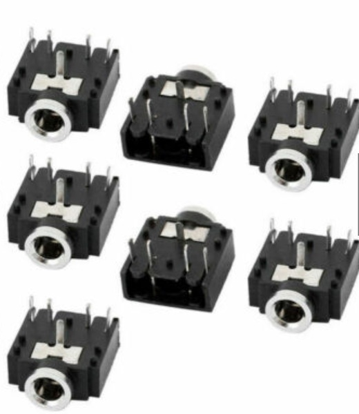

## Xenform_Kicad
#### Some Custom Kicad Symbols and Footprints
#### by Scott Kildall

### Overview
I have several custom symbols and footprints for parts and circuits, that I've created with Kicad 5.0

### Parts

(1) TRS Jack:

This is a common TRS jack (stereo audio). I'm not using the inner 2 pins, which are connected to ground, except for mounting. The middle pin is also GND, so this is redundant.

https://www.newark.com/cliff-electronic-components/fc68133/stereo-jack-3-5mm-5pos-pcb/dp/75Y0813

(2) Adafruit Metro Mini

(3) 4051_MUX
CD4051B Through-hole chip. Since I added a custom footprint for this, I also added the symbol to my .lib file.

Pin #1 = Ch 4
Pin #2 = Ch 6
Pin #3 = IO (X)
Pin #4 = Ch 7
Pin #5 = Ch 5
Pin #6 = InH (GND)
Pin #7 = VEE (GND)
Pin #8 = VSS (GND)
Pin #9 = S3 (C)
Pin #10 = S2 (B)
Pin #11 = S1 (A)
Pin #12 = Ch 3
Pin #13 = Ch 1
Pin #14 = Ch 0
Pin #15 = Ch 2
Pin #16 = VDD (V+)

### Custom Symbols
I have several custom symbols and footprints for these projects, located here

### Custom Footprints
Located in the Xenoform_Kicad.pretty folder
(1) 3.5mm_TRS_jack.kicad_mod
(1) Adafruit_MetroMini.kicad_mod

